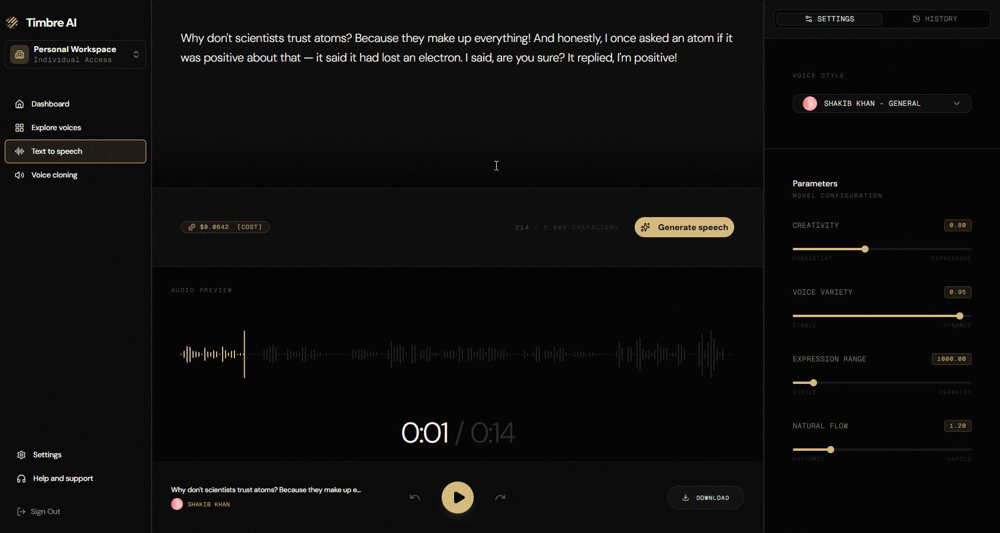
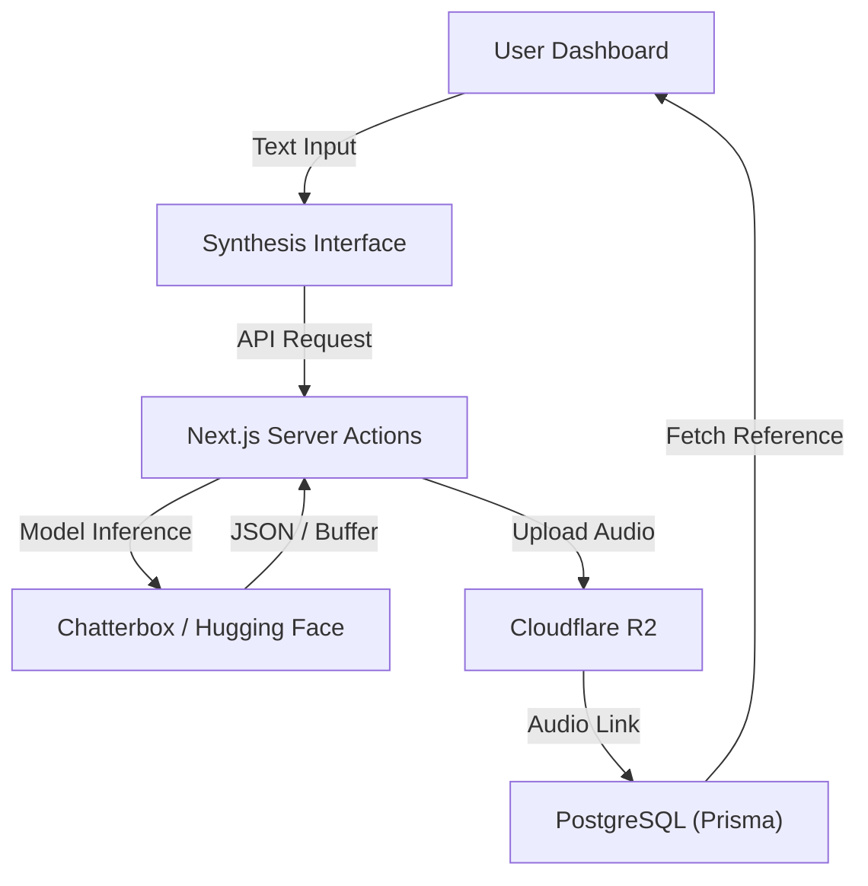

#  Timbre AI: Institutional-Grade Vocal Synthesis



Timbre AI is a premium, high-performance vocal synthesis engine designed for developers and enterprise scale. It combines advanced AI-modeled vocal topography with an institutional-grade interface to provide unmatched realism and sub-200ms latency.

## 🚀 Vision & Architecture

Timbre AI is built for mission-critical applications:
- **Synthesis Engine**: Real-time text-to-speech with natural inflection.
- **Voice Cloning**: Clone identity with as little as 30 seconds of audio.
- **Model Registry**: Securely manage and deploy unique vocal identities.

### 🛠️ Technology Stack
- **Framework**: Next.js (App Router, Server Actions)
- **Authentication**: Better Auth (Prisma adapter)
- **Database**: PostgreSQL (Prisma ORM)
- **Object Storage**: Cloudflare R2 / S3
- **Vocal Logic**: Hugging Face + Chatterbox TTS
- **Styling**: Tailwind CSS (Swiss Design Language)

## 📦 Getting Started

### 1. Prerequisites
Ensure you have the following installed:
- Node.js (v18+)
- PostgreSQL (or a Neon database)
- R2/S3 Bucket accesses

### 2. Installation
Clone the repository and initialize the dependencies:
```bash
git clone https://github.com/lwshakib/timbre-ai-voice-synthesis.git
cd timbre-ai-voice-synthesis
npm install
```

### 3. Configuration
Timbre AI requires several service integrations. Copy the example environment file and fill in your credentials:
```bash
cp .env.example .env
```
Refer to [`.env.example`](.env.example) for detailed configuration requirements.

### 4. Database Setup
Initialize your database schema:
```bash
npx prisma db push
```

### 5. Launch Terminal
Start the local development environment:
```bash
npm run dev
```

## 📜 Project Standards
Timbre AI maintains high standards for contributions and community interaction. Refer to the following documentation:
- [**Contributing Guide**](CONTRIBUTING.md)
- [**Code of Conduct**](CODE_OF_CONDUCT.md)
- [**Issue Templates**](.github/ISSUE_TEMPLATE/)

## 🧑‍💻 Technical Flow (Mermaid)



## ⚖️ License
© 2026 Timbre AI Technologies AG. All rights reserved.
For licensing inquiries, contact [support@timbreai.build](mailto:support@timbreai.build).
